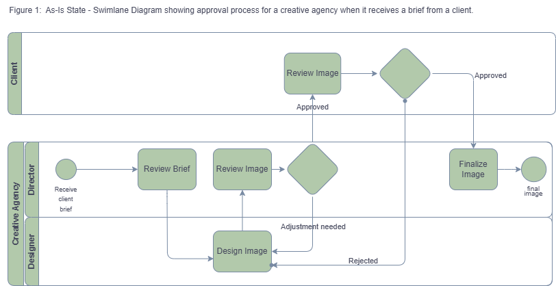
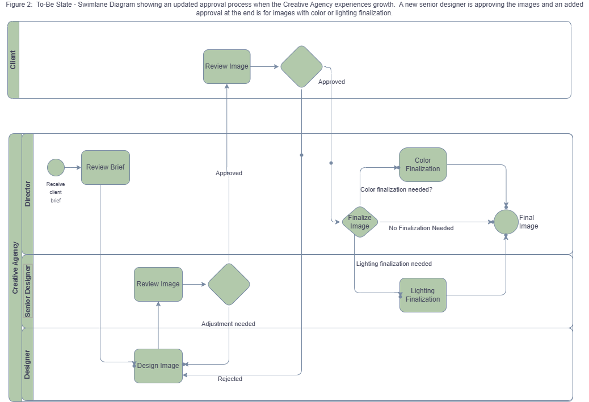

# Business-Analysis-Portfolio

## Description
Consists of 3 projects for Business Analysis Certification  
(Project 1 Business Case,  Project 2 CRM Capstone,  and Project 3 Process Improvement)

---

## Business Case
- Developed a business case for a company with a problematic Accounts Payable invoice processing.
- The recommendation was implementation of an automated invoicing software.
- I prepared the sections in blue print (Executive Summary, Initiatives or Solutions Considered, Capability Assessment, and Impact Analysis)

---

## Capstone Project - CRM Implementation
- The CRM implementation was to help the sales team manage growing customer information and track real-time sales data.
- The Capstone Project tracks the requirements, epics, user stories, roadmap, Gant Chart, and Traceability Matrix for the CRM implementation.
- My contribution to project which included the partial preparation of the epics, user stories, and traceability matrix.

---

## Process Redesign 
- Developed As-Is and To-Be BPMN diagrams
- The diagrams showcase the approval process of a creative agency when a customer submits a brief for design work.
- The As-Is state shows how the company presently approves submissions for designs.  
- The To-Be state shows how the company will arrange approvals when the company grows.

## As-Is Process

## To-Be Process

---

## Skills Demonstrated
- Business Analysis
- Requirements gathering
- Process mapping (BPMN)
- Project planning
